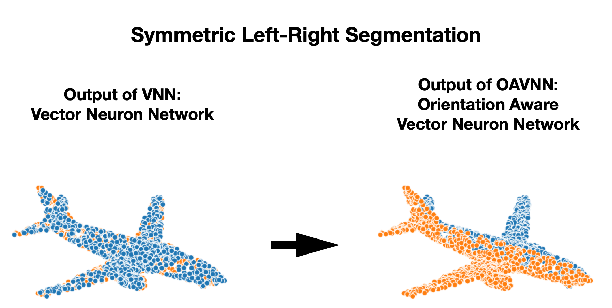

# OAVNN

<h1>Abstract</h1>
Equivariant neural networks have been adopted in a variety of 3D learning areas. In this paper, we identify and address a fundamental problem of equivariant networks: their ambiguity to symmetries. For a left-right symmetric input, like an airplane, these networks cannot complete symmetry-dependent tasks like segmenting the object into its left and right sides. We tackle this problem by adding components that resolve symmetry ambiguities while preserving rotational equivariance. We present OAVNN: Orientation Aware Vector Neuron Network, an extension of the <a href=https://arxiv.org/abs/2104.12229> Vector Neuron Network</a>. OAVNN is a rotation equivariant network that is robust to planar symmetric inputs. Our network consists of three key components. First, we introduce an algorithm to calculate features for detecting symmetries. Second, we create an orientation-aware linear layer that is sensitive to symmetries. Finally, we construct an attention mechanism that relates directional information across points. We evaluate the network using left-right segmentation and find that the network quickly obtains accurate segmentations. We hope this work motivates investigations on the expressivity of equivariant networks to symmetric objects. 

<h1>Data</h1>
The code is structured to use any point cloud dataset of HDF5 type. Each file must only contain the x,y,z point locations (part labels are not necessary). We use the <a href=https://shapenet.org/> Shapenet dataset</a> for our experiments.

<h1>Running the Model</h1>

<ol>
  <li>Set up the conda environment using the provided environment.yml file.</li>
  <li>Train/Test the model using the following command:
    
        python run_models.py --exp_name dgcnn_cap_run0 --model dgcnn --rot so3 --class_choice cap --data_path PATH --num_points 128
    
  </li>
  <li>Third item</li>
</ol>
